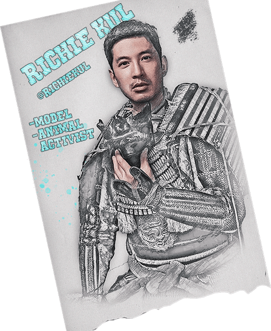
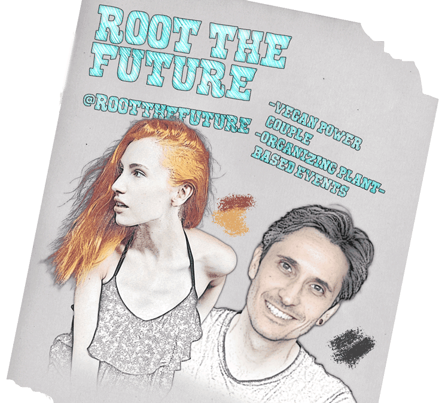
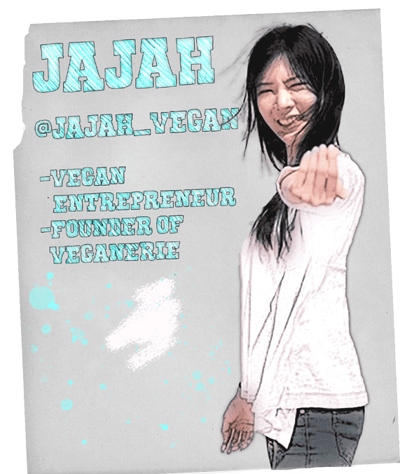

*Meet 4 vegans in Bangkok that inspire with healthy lifestyles, business mindsets and compassionate living.*
  

## Richie Kul - [@richiekul](https://www.instagram.com/richiekul/)

Actor, model and vegan activist. Follow Richie and his vegan dog [@lilymisssunshine](https://www.instagram.com/lilymisssunshine/) to see the life of a plantbased model challenging the outdated macho norms.

Longer interview [here](/posts/smashing-vegan-myths-with-richie-kul/)

## Root The Future [@rootthefuture](https://www.instagram.com/rootthefuture/)

This power couple organized the hugely successful vegan festival in Sansiri backyard in October. Many new projects coming up, follow along! You can also check out their individual accounts [@maxhellier](https://www.instagram.com/maxhellier/) and [@joanna_broomfield](https://www.instagram.com/joanna_broomfield/)

## Jajah [@jajah_vegan](https://www.instagram.com/jajah_vegan/)

Jajah is the founder of [@veganerie](https://www.instagram.com/veganerie/), vegan restaurant with several branches around Bangkok, serving delicious vegan food. An entrepreneur that continuous to motivate and inspire!