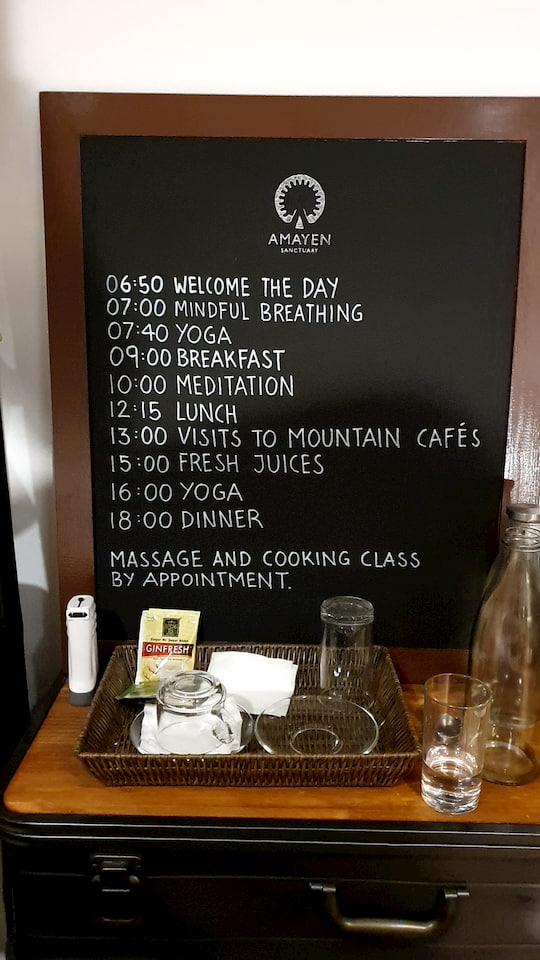
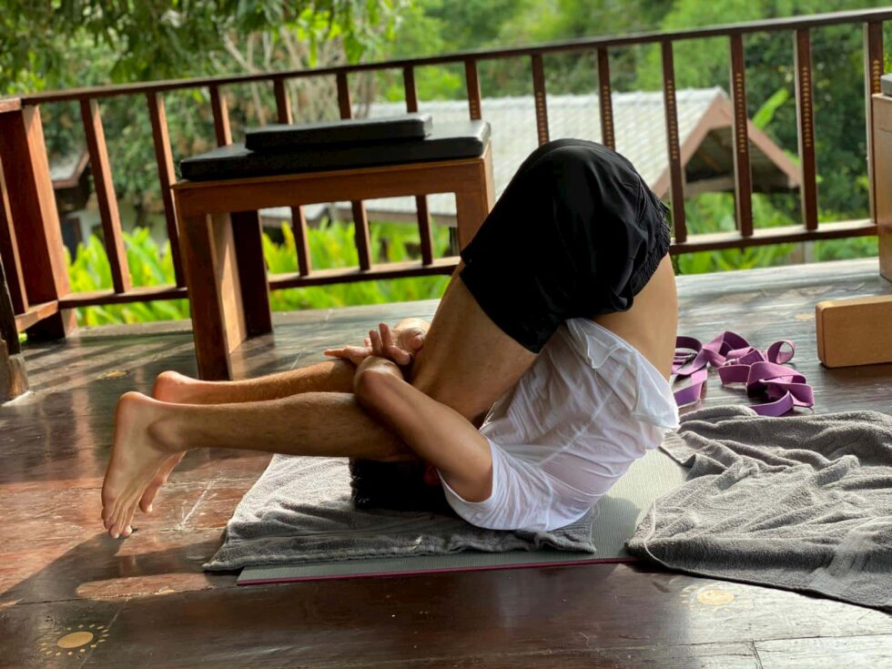
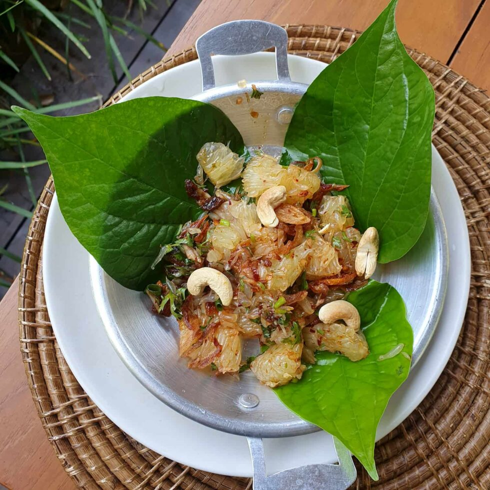

I touch down in Chiang Mai after the short flight from Suvarnabhumi, Bangkok. As I exit the pleasantly air-conditioned arrival hall it’s like walking into a wall of heat. Chiang Mai is unusually hot for August. I am soon picked up by Lin, one of three owners of Amayen Sanctuary, and we depart on the 30-minute drive to get there. I ask about the other guests – I expected to be sharing a van with a few fellow travelers – but it turns out I am the only one booked for these dates. The Covid-pandemic has not been kind to the hospitality business, and Amayen is no exception – especially since a majority of guests come from outside of Thailand. For anyone already in Thailand this opens up a unique opportunity: exclusive access to solitude in the magical setting that is Amayen Sanctuary.
  
As we arrive, I’m served a freshly pressed juice while I’m getting checked in. I get a glance at the daily schedule.

 

During the tour of the grounds the curiosity awakens as we pass by walls filled with quotes, meditation rooms and manifestation stations. I choose to stay in the more traditional wooden style room rather than accepting the free upgrade offered. It’s spacious and has a certain charm about it.
  
I then get some time to freshen up after the travels and get ready for the first yoga session. It happens to be the first of the retreat – and the first of my life. It’s not a good look.
 
It feels good afterward and leaves me hungry for dinner.
 
I believe that a big part of the experience is discovering all the secrets and surprises Amayen has to offer, so I won’t go through anything in detail. What I will say is this:
  
- Right now you have a unique chance to experience a more quiet version of the Sanctuary.
- It might seem pricey, but there is a lot of value in all the sessions (meditation and yoga), massages, food, and overall experience.
- The food is fresh and filling. You are served breakfast by the river before yoga, lunch with dessert, and three-course meals for dinner every night.
- The teachers are great. It was my first time doing yoga and I enjoyed it a lot, both the more relaxing sessions and the tougher ones.

## Getting there

Getting from Bangkok to Amayen is a breeze. 45 minute flight, airport pickup (included in the package), and the short drive.
  

## Books

Amayen recommends a few books to read before, during or after the visit:

[Dr. Joe Dispenza - Becoming Supernatural](https://www.amazon.com/gp/product/1401953115/ref=as_li_tl?ie=UTF8&tag=powerofknow0b-20&camp=1789&creative=9325&linkCode=as2&creativeASIN=1401953115&linkId=7395122077b2fed2e19ab40ad6350ed7)
  

[Eckhart Tolle - A New Earth](https://www.amazon.com/gp/product/B005F1Q9YK/ref=as_li_tl?ie=UTF8&tag=powerofknow0b-20&camp=1789&creative=9325&linkCode=as2&creativeASIN=B005F1Q9YK&linkId=1cfd11ee6b92d9275f08bb9fc181df33)
  

[Eckhart Tolle - The Power of Now](https://www.amazon.com/gp/product/1577314808/ref=as_li_tl?ie=UTF8&tag=powerofknow0b-20&camp=1789&creative=9325&linkCode=as2&creativeASIN=1577314808&linkId=03a1fb7dda259a0344439878bdd228cb)
  

[Sadghuru - Inner Engineering](https://www.amazon.com/gp/product/0812997794/ref=as_li_tl?ie=UTF8&tag=powerofknow0b-20&camp=1789&creative=9325&linkCode=as2&creativeASIN=0812997794&linkId=6fed10bd2df19cc24ddeb4af41e55d2c)
  

[Ibrahim Karim Dr. Sc. - BioGeometry Signatures](https://www.amazon.com/gp/product/1537783882/ref=as_li_tl?ie=UTF8&tag=powerofknow0b-20&camp=1789&creative=9325&linkCode=as2&creativeASIN=1537783882&linkId=6b6e8d7e3e5fe517020d3fcf1f9ae7ba)
  

[Rhonda Byrne - The Secret](https://www.amazon.com/gp/product/1582701709/ref=as_li_tl?ie=UTF8&tag=powerofknow0b-20&camp=1789&creative=9325&linkCode=as2&creativeASIN=1582701709&linkId=fbdee51b9ec95f1f6904b241aa1527be)
  

[Rhonda Byrne - The Power](https://www.amazon.com/gp/product/1439181780/ref=as_li_tl?ie=UTF8&tag=powerofknow0b-20&camp=1789&creative=9325&linkCode=as2&creativeASIN=1439181780&linkId=0793686ceb46c2541ce53e845f21f86b)
  

[Dan Millman - The Life You Were Born to Live](https://www.amazon.com/gp/product/091581160X/ref=as_li_tl?ie=UTF8&tag=powerofknow0b-20&camp=1789&creative=9325&linkCode=as2&creativeASIN=091581160X&linkId=cf24c5a3a7a0c572fb236c6be573920c)
  

[Abraham Hicks - Ask and It Is Given](https://www.amazon.com/gp/product/1401904599/ref=as_li_tl?ie=UTF8&tag=powerofknow0b-20&camp=1789&creative=9325&linkCode=as2&creativeASIN=1401904599&linkId=61fc6c0e0796856d97fb74fb9d2813be)

## Official website

Read more at [Amayen's website](amayen.com)
  

**NOTE: since my visit, Amayen has changed it's approach and is focusing on experiences in different locations nation-wide. Check their website for more.**