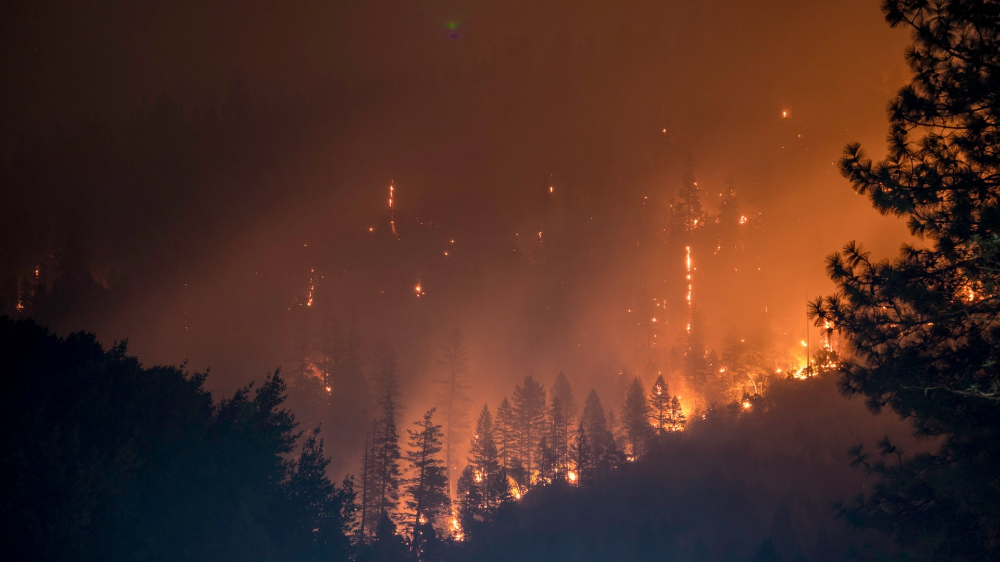
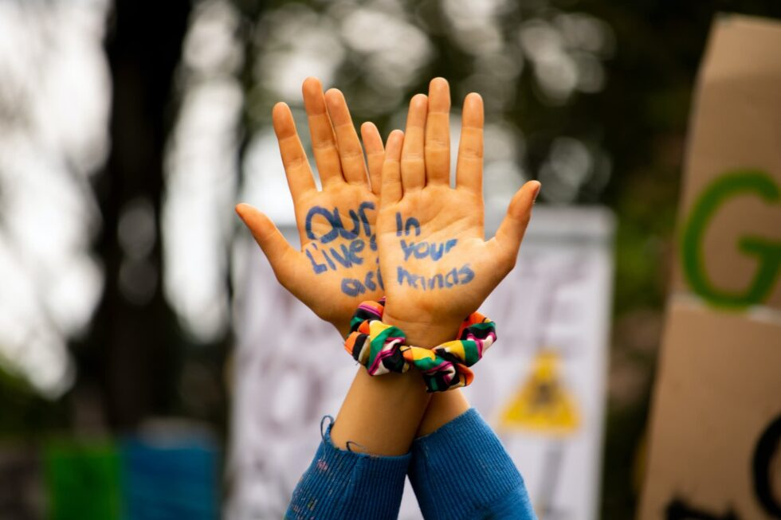
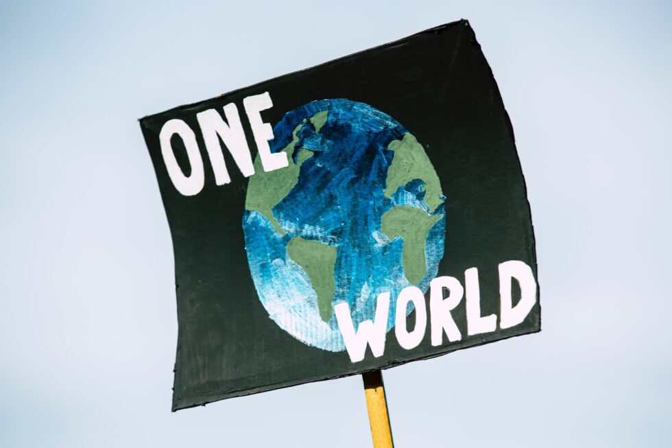

**In his book “We Are The Weather”, Jonathan Safran Foer offers a sliver of hope for humanity to crawl back from the brink of destruction.**
  

Climate change has a PR problem. As marine biologist Randy Olson puts it, “Climate is quite possibly the most boring subject the science world has ever had to present to the public.” It is complex and therefore hard to explain in a compelling and coherent way. There are no clear villains. The change is gradual, thus making us accept that annual “thousand-year floods” and exploding numbers of deadly forest fires is just “weather”. Result: the planetary crisis is not a story suited for engaging the human mind and inspiring action.
  

This is put forward by Jonathan Safran Foer in “We Are The Weather”. Foer starts out painting a bleak picture of the current situation and our chances to solve it. We may accept we are destroying the planet, but we don’t _believe_ it, he says. We might understand we need to act, but we simply do not. But suddenly Foer offers us a sliver of hope, hinting at society’s capability for positive change when grassroots advocacy meets top-down publicity campaigns and policies. Norms can change. Look at the decline of smoking, Foer says. Look at the curing of polio.

But what are the norms that have to change? What is the most effective way to reduce our impact on the planet? Foer argues it is to change the way we eat. So why has Al Gore and other influential voices in this space ultimately avoided the subject? It is thought of as a losing hand. Foer explains:

>“Conversations about meat, dairy and eggs make people defensive. They make people annoyed. No one who isn’t vegan is eager to go there, and the eagerness of vegans can be a further turnoff.”

 So when science says our production of meat, dairy and eggs is destroying the planet, but talking about reducing consumption of it makes people annoyed, how do we approach the subject? Foer suggests a solution. A compromise, we might call it: no animal products before dinner. He is trying to find a way to talk about the problem that is not immediately dismissed by those who are conditioned to eat animal products, while at the same time inspiring enough positive change to avoid the worst outcomes of climate change.
  
Let’s look at some data presented in the book as to why animal agriculture is a central issue in the planetary crisis.
  

**The Bigger Picture**

- Even the more conservative numbers from studies find that livestock is a leading cause of climate change. The Food and Agriculture Organization (FAO) has for example calculated it is responsible for 14.5 percent of annual global greenhouse gas emissions.
- Other researchers have found that livestock is in fact the leading cause of climate change. The Worldwatch Institute estimates that livestock is responsible for 51 percent of emissions. They included the CO2 that forests that were cleared for animal agriculture would not be able to absorb as well as CO2 exhaled by the animals.
  

Is it _a_ leading cause or _the_ leading cause? The higher estimate has been favored by the UN and UNESCO and seems more realistic as they take into account areas that FAO missed. We can discuss estimates all day long, but it is clear we can’t address climate change without addressing animal agriculture.
  

**Resource use and deforestation**
- 59 percent of land that is suitable for growing crops is used to grow food for livestock (*Steinfeld et al., Livestock’s Long Shadow*).
- One-third of all freshwater humans use goes to livestock (*Gerbens-Leenes et al., Water Footprint of Poultry, Pork and Beef*).
- 80 percent of deforestation (91 percent in the Amazonas) occurs to clear land to grow food for livestock or for their grazing (*Food and Agriculture Organization of the United Nations, Deforestation Causes Global Warming*).
  

The food and water fed to animals could have been used to feed humans directly, or the land could have been utilized to grow other crops fit for human consumption. Sure, humans eat the animals that are fed with the crops and the fresh water, but the inefficiency of this is staggering. In addition to this, animal agriculture is the leading cause of deforestation (World Wildlife Fund, *Forest Conversion*), which further damages the planet by the release of CO2 when trees are burned and the loss of trees that otherwise would have absorbed CO2.
  

**Greenhouse gases**
  
Animal agriculture is responsible for 37 percent of anthropogenic (man-made) methane emissions and 65 percent of anthropogenic nitrous oxide emissions (Steinfeld et al., *Livestock’s Long Shadow*). Methane and nitrous oxide have much higher global warming potential than CO2 (34 and 310 times higher, respectively (*Intergovernmental Panel on Climate Change, Climate Change*)).
  
In other words, these two greenhouse gases are masters at trapping heat. The good news is that they are primarily created by our food choices and therefore relatively easy to cut out (Clark, *Greenhouse Gases*).
  

**The benefit of focusing efforts on food choices**
- Compared to the three other areas where one can make the most impact (have fewer children, avoid air travel, live car-free) (Wynes and Nicholas, *Climate Mitigation Gap*), only plant-based eating immediately addresses the worst greenhouse gases methane and nitrous oxide.
- Avoiding air travel or cars is something many people can not do due to their work or life situation. Changing what one eats is comparatively easier for most.
  

**CO2 equivalents (CO2e) in pounds – comparison**
  

Beef: 6.61  
Legumes: 0.11  
(Center for Sustainable Systems, *Carbon Footprint Factsheet*)
  

**Why a vegetarian diet is not a viable solution**
  
Avoiding animal products completely only for breakfast and lunch has a lower CO2e footprint than the average vegetarian diet (Kim et al., *Country-specific dietary shifts*).
  

**Some other effects of animal food consumption on the population**
- People who eat diets high in animal protein are four times as likely to die of cancer compared to people eating diets low in animal protein (Levine et. al., *Low Protein Intake*). To put that in relation to smoking: smokers are “only” three times more likely to die of cancer compared to nonsmokers (Centers for Disease Control and Prevention, *Tobacco-Related Mortality*).
  

**The calculation**

- To meet the Paris accord’s two-degree goal, each individual’s annual CO2e budget must not exceed 2.1 metric tons by 2050 (Girod et al., *Climate Policy*).
- The global average is 4.5 metric tons per year (*Carbon Emissions per Person, by Country*).
- No animal products for breakfast and lunch saves 1.3 metric tons per person per year (Raychel Santo and Brent Kim, John Hopkins University).
  

If you’re doing the math, you’ll see that this still does not put us in the black (or should I say green?). But it takes us within reach. And if you are already fully plant-based, you’re probably thinking that the solution to get even closer is quite simple. If we’ve removed animal products from breakfast and lunch, why not remove it completely. That might give humanity the chance to keep living on this planet for generations to come. As Foer states in the book:

>“We must either let some eating habits go or let the planet go.”

I know what I choose. Do you?

Get We Are The Weather [HERE](https://amzn.to/2IVRd2t).

Another great book to learn more about the challenges ahead is [The Uninhabitable Earth](https://amzn.to/31wRrU6) by David Wallace-Wells.