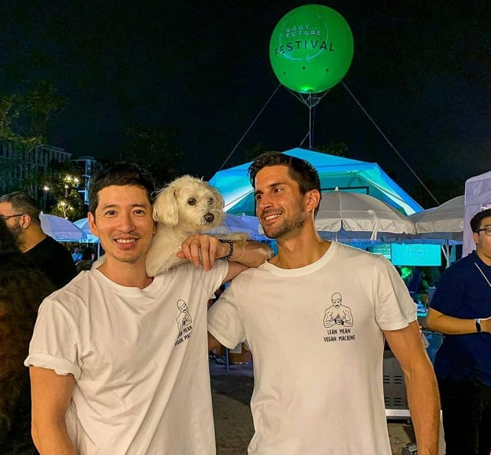

**I met up with vegan model, actor and animal activist Richie Kul to talk about his first months in Bangkok, his impression of the vegan scene in town and how he keeps challenging the norms of masculinity by smashing long-lived myths about veganism.**
  
We meet at May Veggie Home, the vegan restaurant in Asoke that’s been around since 2011. Richie doesn’t come alone; over his shoulder hangs a pet carrier for his rescue dog Lily. He explains he can’t stand leaving her alone in their new Asoke apartment, located not far from where we meet. Richie goes on to order the mushroom larb in what comes across as perfect Thai. Not all that surprising, perhaps, since his parents are in fact Thai. But having been raised in the US and spent the last five years in Hong Kong, not everyone knows about his Thai roots. Especially since he is not that easy to pinpoint by his looks either. He explains that this can be a benefit in his job as a model, since he effortlessly moves between being cast as a Japanese samurai one day and a Eurasian family father the next.
  
His acting and modeling is used to broadcast the message of compassion toward all living beings. “I think it helps to show that you can still be strong, healthy and masculine without harming animals.” His followers on Instagram also know that he at times shows this with pictures of the more daring kind. “I think we need to do what we can to get the message out there. If it sometimes means showing some more skin, so be it. It also helps challenge the myth that vegans can’t be fit or build muscles. To attract more people to the cause, you sometimes have to sweeten the pot”, he explains with a smile.

> “To attract more people to the cause, you sometimes have to sweeten the pot“

## How it all began

As the food arrives, Richie launches into the story of how he turned vegetarian already at the tender age of thirteen, wanting to live in a more compassionate way. “At that time, I was teased a lot in school. My parents were against it as well. I didn’t listen to any of them, I just did my thing.”  
  
After two decades as a vegetarian, Richie became more aware of the cruelty inherent in the dairy, egg, fashion and entertainment industries. He has now been vegan for 6 years. To the question of why the transition from vegetarianism took so long, he thinks for a while before answering. “The truth about cruelty in these other industries are more widely disseminated today than it was back then. Of course I wish I would have made the transition sooner, but perhaps I had tuned out a little too much, believing that not eating meat was enough to not contribute to needless suffering. Today I know better.”

## New in Bangkok

Having permanently moved to Bangkok from Hong Kong two months ago, he has explored many of the vegan options in town already. “Compared to a few years ago when I visited, I feel that the movement has grown a lot. Many incredible restaurants have opened, as well as fully vegan brands both in supermarkets and online.” When asked to mention some favorite restaurants in town, he thinks for a bit before answering. “I love Goodsouls Kitchen, Bangkok City Diner, Vistro and Golden State, to mention a few. And I look forward to visiting Nature’s Charm soon. It looks amazing!"

Richie’s plan is to continue his acting and modeling career in Bangkok, having already landed several gigs since moving here. “In addition to this, I want to introduce my followers to the best vegan food and fashion brands in town and help support small, cruelty-free businesses.”

## Vegan inspiration

I ask what vegan influencers and social media accounts inspires him on a daily basis. “There are many, but sometimes if I’m feeling discouraged, I look at pictures and videos of rescued farm animals at sanctuaries like [@edgarsmission](https://www.instagram.com/edgarsmission), [@lighthousefarmsanctuary](https://www.instagram.com/lighthousefarmsanctuary), [@centraltexaspigrescue](https://www.instagram.com/centraltexaspigrescue) and [@goatsofanarchy](https://www.instagram.com/goatsofanarchy). It helps to focus on the positive and hopeful side of things. In Bangkok, I am impressed by the engaging content that Root The Future showcases on social media.”
  
Having finished the meal, we have a quick look at the selection of vegan desserts but opt for the healthier option: a walk to the sky train. I ask him what he would say to motivate all the people for whom a vegan diet seems to be somewhat extreme or too difficult to implement. “Well, many of us claim to love animals and be against any violence toward them, but we have to walk the talk and align our actions with our values. Just as it would be preposterous for a dog lover to be eating dog meat, it makes no sense to be an animal lover while also eating them. If we truly love animals and value peace and compassion, going vegan is the only answer.” And with all the new restaurants and brands entering the vegan scene, I can just echo Richie’s words: “It’s a great time to be vegan in Bangkok.”

>“It’s a great time to be vegan in Bangkok.”

We say goodbye and Richie and Lily get on the train, with the aim set on exciting months ahead filled with photoshoots, auditions, vegan restaurants to try out and fellow influencers to meet up and collaborate with. All to spread the message of compassion to as many people as possible.