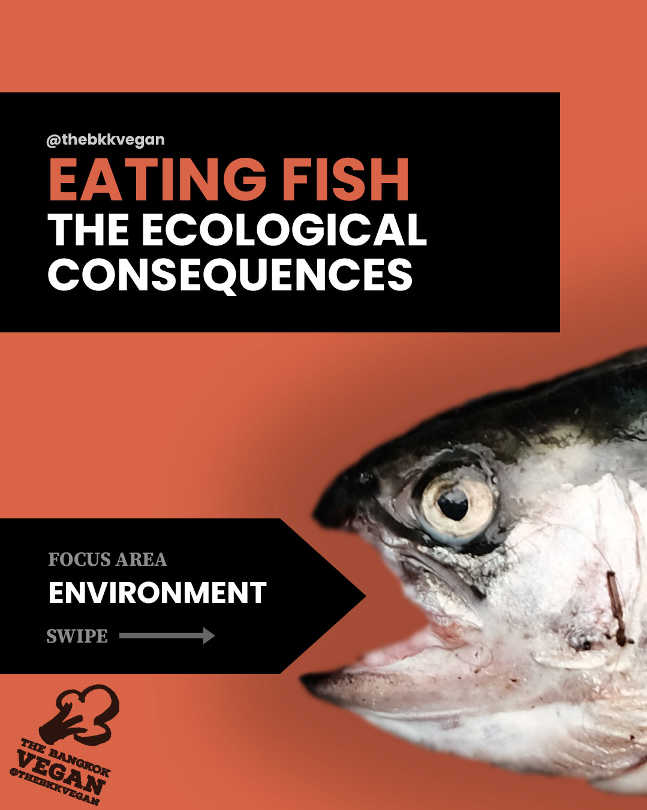
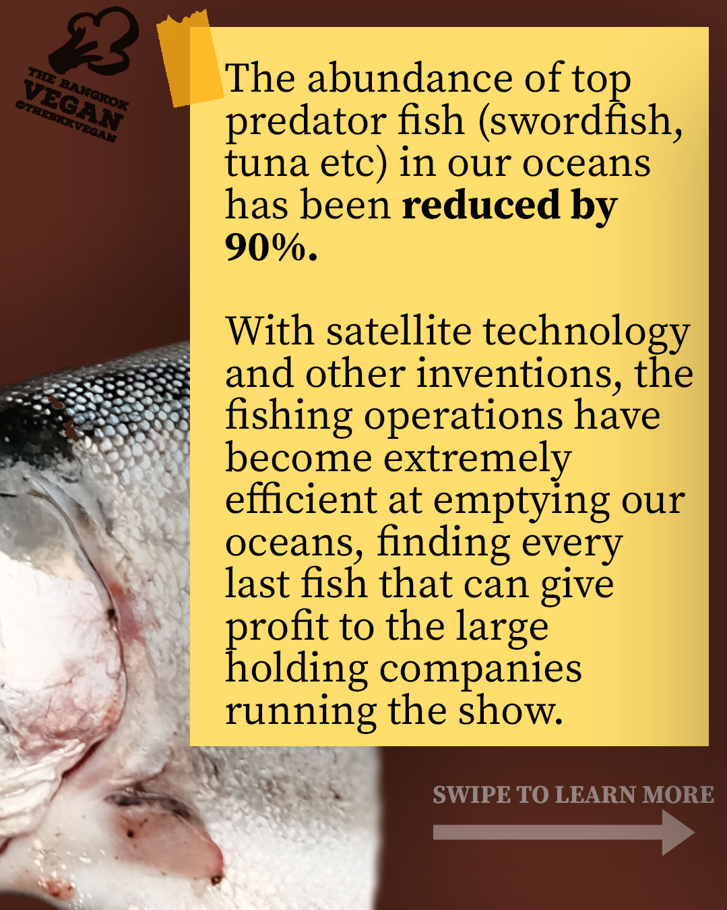
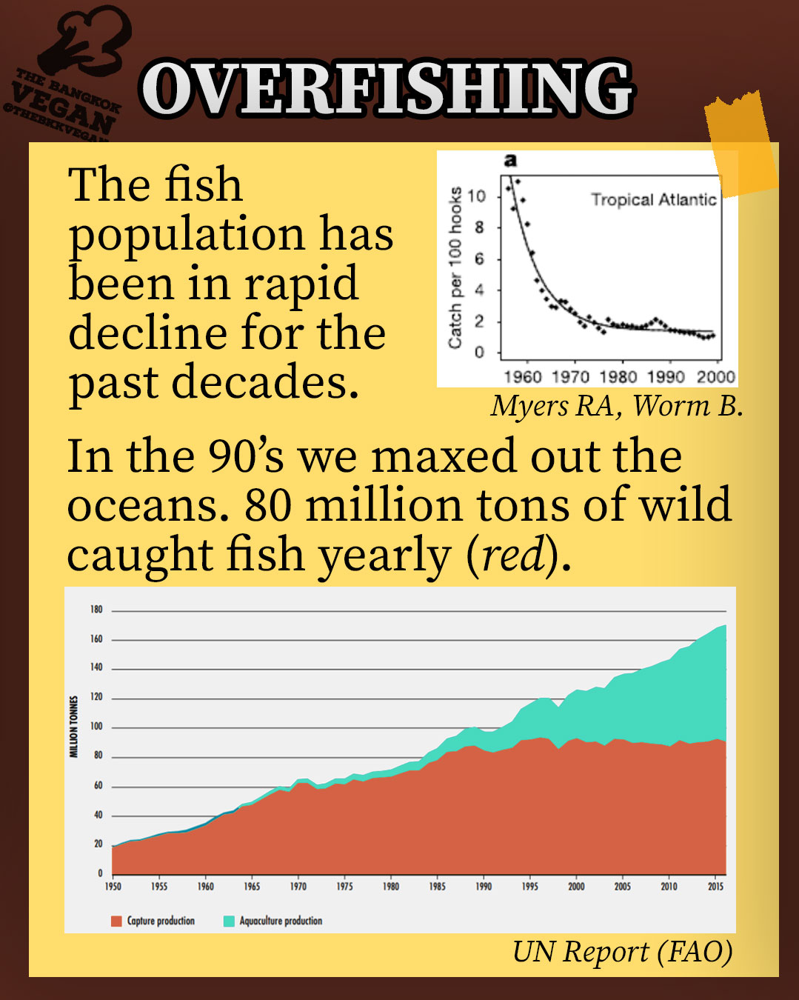
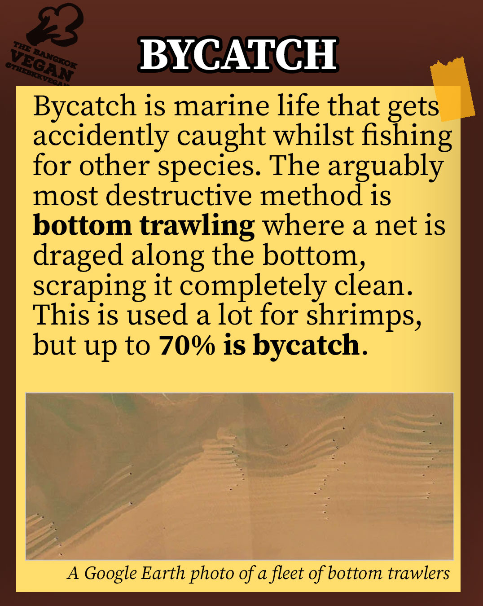
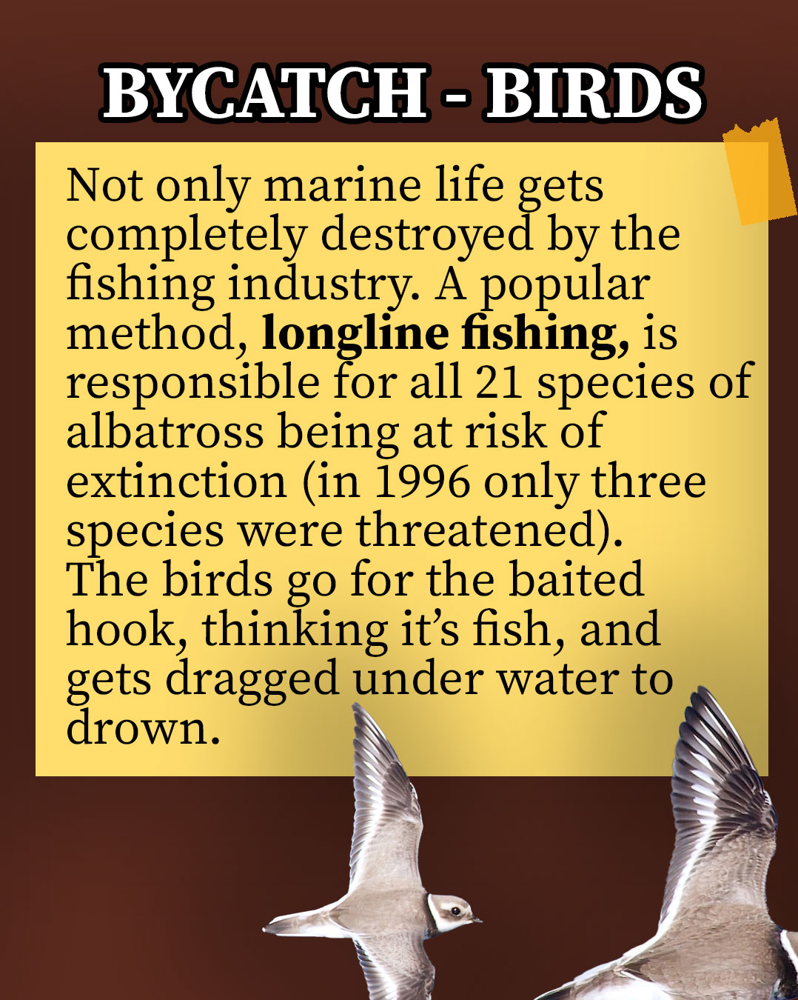
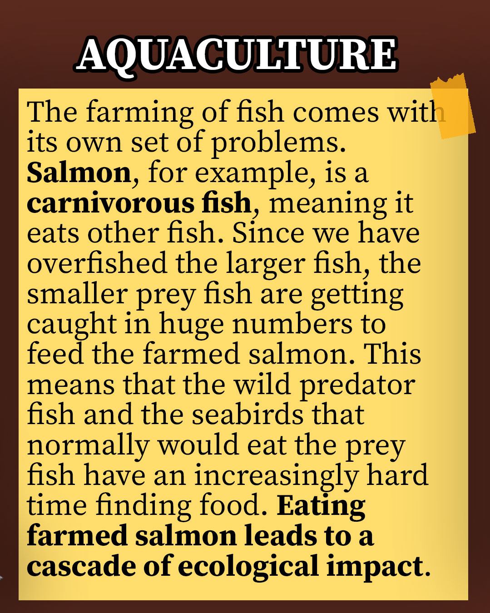
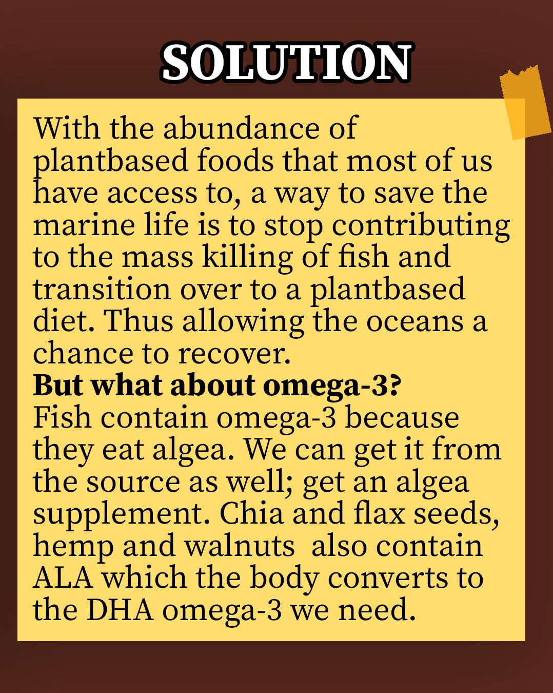

*The sad truth about the state of our oceans and the industrial fishing.*
  

[This slideshow on Instagram](https://www.instagram.com/p/CMwcHTHLsPK/)

[FAO Study link](http://www.fao.org/state-of-fisheries-aquaculture)
